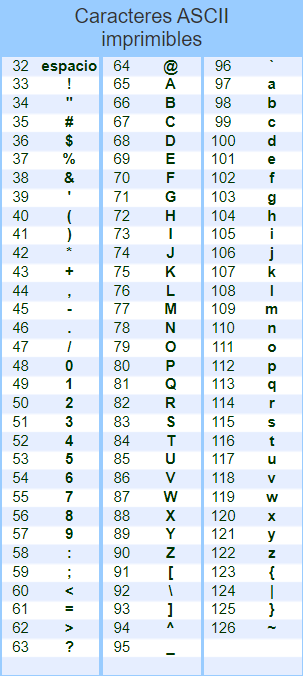

# Problema 1 (Valor 1.5)

## Función hex2int(cadena) 

1. La función `hex2int` debe tomar un solo parámetro, que es una cadena de caracteres `cadena`, representando un número hexadecimal.
2. La función debe verificar que la longitud de `cadena` sea de un solo caracter.
3. Si la longitud de `cadena` no es igual a 1, la función debe imprimir _"Valor ingresado incorrecto"_ y devolver -1 como indicador de error.
3. La función debe verificar si el parámetro está en el rango correspondiente a los dígitos hexadecimales 0 - F. Si es así, debe realizar la conversión adecuada y devolver el resultado como un número entero.
6. Si el valor ingresado no está en el rango adecuado, la función debe imprimir _"Valor ingresado incorrecto"_ y devolver -1 como indicador de error.

En la siguiente imagen encontrarás los códigos ASCII de los caracteres que necesitas. 
<div style="text-align:center;">
    
</div>

También es posible que necesites usar la función `ord()`. Esta función te devolverá el valor entero que corresponde al código ASCII de ese carácter. Por ejemplo, si tienes un carácter como 'A', `ord('A')` devolverá 65, que es el código ASCII para la letra mayúscula 'A'. `ord('a')` devolverá 97.


Ejemplos de ejecución:
```Python
Ingresa un número hexadecimal>> e
E = 14

Ingresa un número hexadecimal>> g
Valor ingresado incorrecto
G = -1

Ingresa un número hexadecimal>> 45
Valor ingresado incorrecto
45 = -1
```
---
# Problema 2 (Valor 1.0)

## Función forman_triangulo(a, b, c)
Si tienes 3 líneas rectas, posiblemente de diferentes longitudes, puede ser o no posible colocarlas de manera que formen un triángulo cuando sus extremos se tocan. Por ejemplo, si todas las líneas rectas tienen una longitud de 6 centímetros, entonces puedes construir fácilmente un triángulo equilátero con ellas. Sin embargo, si una línea recta mide 6 centímetros, mientras que las otras dos miden solo 2 centímetros cada una, entonces no puedes formar un triángulo. En general, si alguna de las longitudes es mayor o igual a la suma de las otras dos, entonces las longitudes no se pueden usar para formar un triángulo. De lo contrario, sí puedes formar un triángulo.

Escribe una función que determine si tres longitudes pueden o no formar un triángulo. La función recibe 3 números enteros y retorna `True` si se puede formar un triángulo y `False` en caso contrario. 

En la función `main()`, escribe un programa que lea 3 longitudes del usuario y demuestre el comportamiento de esta función.

---
# Problema 3 (Valor 1.5)

## Función decimal2binary(integer)

Escribe una función que convierta un número decimal (base 10) a binario (base 2). La función recibe un número entero decimal y luego utiliza el algoritmo que se muestra a continuación para realizar la conversión. La función retorna una cadena de caracteres que contendrá la representación binaria del número binario.

### Pseudocódgo de la función
```
Sea resultado una cadena vacía
Sea q el número a convertir
Repite:
	Hacer r igual al residuo cuando se divide q por 2
	Convierte r a una cadena y agrégalo al principio de resultado
	Divide q por 2, descartando cualquier residuo, y almacena el resultado nuevamente en q
hasta que q sea 0
```
---
# Problema 4 (Valor 1.0)

## Función calcular_tarifa(distancia_km)
En una ciudad, las tarifas de taxi consisten en una tarifa base de $4000, más $250 por cada 140 metros recorridos. Escribe una función que tome la distancia recorrida (en kilómetros) como su único parámetro y devuelva la tarifa total como su único resultado. Escribe un programa principal que demuestre la función. Redondea a dos cifras decimales el resultado antes de retornarlo. Usa esta función: `round(resultado,2)`

---
# Problema 5 
Escribe la función main() de donde se llamarán todas las otras funciones. 